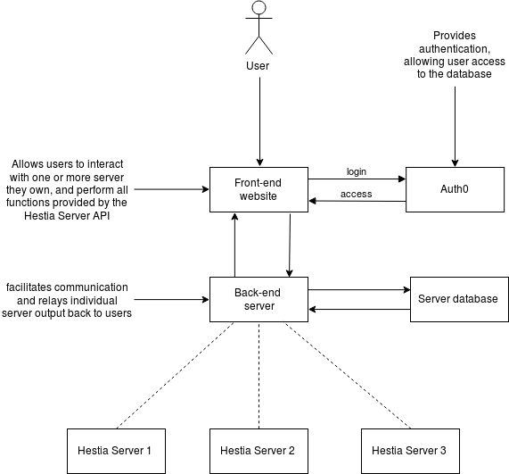
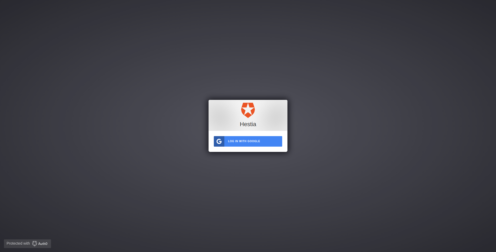
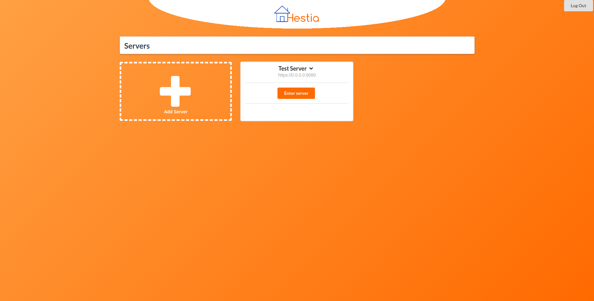
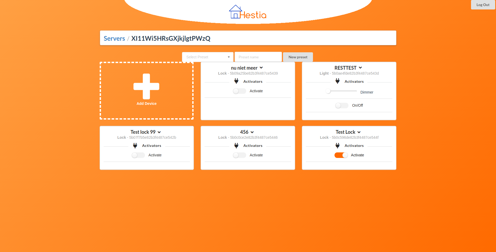
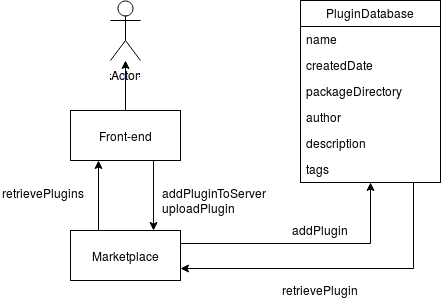

### Clients
- F. te Nijenhuis
- L. Holdijk
### Authors
* A. Lalis
* E. Abdo
* N. Dijkema
* P. Oetinger
* R. Bell
* R.T. Nijman
* S. Oegema
* T.K. Harrison
### Teaching Assistant
Feiko Ritsema
## Introduction
The Hestia Home Automation System, developed by the clients, aims to make home automation simple again. The local server infrastructure that facilitates communication and control of the various peripherals in one's home has already been implemented by the clients. In addition to this local server, an Android application has been pre-made by the client and is available for reference. As it stands users of Hestia are unable to access their home servers from outside of their local network. This, coupled with the lack of client side interfacing, limits the ease of use and widespread adoption of the Hestia system.
To improve on this, we will develop a web based interface for Hestia. There are two main systems under consideration: the front-end (the user interface which the client interacts through a browser), and the back-end (which serves as a middleman between local Hestia servers and the front-end).
This document describes the functionality of these systems, their interaction, and our motivation behind their underlying design choices.
### Overview
Our goal for this project is to create a web interface for Hestia. This web interface, which is hosted on a central server, should allow users to log in and connect to their local Hestia servers. This allows users to interact with their home automation system remotely.

A Hestia server is a *controller* that manages a set of *peripherals*. Those peripherals are the devices to be automated. These could, for example, be lights, locks, or any other programmable devices. This is possible because Hestia is designed to be peripheral independent via a plugin infrastructure.

Additionally, the client would like to have a *marketplace*, where independent creators can submit plugins to be made available to other Hestia users. These users can then supply feedback to the developer on the quality of the plugin, such that other users can make informed choices on which plugins to use.

The clients have created this system using the REST API. This decouples our work from the underlying infrastructure of Hestia so our main interactions with a local Hestia server will be through *GET* and *POST* style requests.
## General Overview of the System
The Hestia Web Interface will be divided into two main sub-systems as mentioned in the introduction.
* The front-end user interface, with which the user interacts through a browser.
* The back-end server that connects users to their local Hestia controllers, and holds information on each user and their servers.

## Website Front-End
Since the front-end of the website is the first aspect of the product that the customer will interact with, and will be one of the main sources of content or discontent throughout their user experience, a variety of design choices had to be made.
The website will allow a user to connect to their controllers through a web server, and then manage the devices on their controllers through a range of different controls, and do this in the knowledge that they and their information are being kept safe.



### Design choices
#### Structural choices
The page is laid out in the following manner, as shown above: once the user has logged in, they are shown all their servers, demarcated by name and IP address, along with the option to add a new server. Once they have selected a server, the user is shown all devices on that server. The devices are laid out in the same way as the servers are, with each device having it's name, it's ID, and all of it's activators. The option to add another device is also there.
Each page scales to the screensize, meaning that as many or as few elements are shown in each row as is appropriate for the screensize of the device being used to view the page. Our webapp then has full functionality when viewed through a mobile browser.

We initially decided to use [Google Firebase](https://firebase.google.com/) for both login and storing each users' servers. Firebase is a mobile development platform which provides a range of scaleable services. A user logged in using some social account such as their email address or Facebook, and then the user's servers were found from the database of servers which was also stored on Firebase.

However, we then switched to [Auth0](https://auth0.com/), an online authentication provider for login. Once the user logs in (again with a social account), the user's information will be used to get all their servers from our [PostgreSQl](https://www.postgresql.org/) database, and connect to these servers. The complete login flow with Auth0 is detailed below. The front-end is currently developed in [Vue.js](https://vuejs.org/), in  order to simplify the development of our user interface. The main focus of the website will be on listing the devices managed by their controllers, and on the operations that can be applied to them. These will mirror those already implemented by Hestia, such as renaming or deleting a device, but with more streamlined interfacing added, such as using buttons and sliders in order to change the activators of a device, instead of having to directly enter values. Additionally, more functionality such as the ability to batch apply presets will be implemented in the back-end and presented for use in the front-end

Within Vue, two design patterns were used to simplify development. They were:
  1. Singleton pattern - By using a Vue store we ensure a single point of reference for the state of the web application. All changes to state are routed through the store, thereby propagating state change throughout the front-end.
  2. Dispatch pattern - This facilitates rapidly extending the front-end to account for and consume new endpoints. It splits up the dispatch process into two steps. Preparing the dispatch payload in `beforeDispatch`, dispatching the payload in `dispatch`. The functions from these two modules are then coordinated in the Vue store to handle updating state. Though it may sound trivial, structuring the API interaction in this manner greatly improved development speed.
#### Aesthetical choices
The design overall is quite minimalist, with some elements such as colour taken from the Hestia logo. Aside from the main Hestia logo, the icons used are from [Semantic UI](https://semantic-ui.com/), which provides a large set of intuitive, user friendly icons.
## Website Back-End
The back-end of the webapp will serve as a middleman between the web front-end and the user's controllers. This means that there needs to be an interface to be able to send queries to the server. Furthermore, a user database is required in order to maintain a secure environment in which users may only have permission to interact with systems they own. Unauthorized access to server data, user data, or any other sensitive information is completely forbidden.
### Design decisions
For the design of the webapp we initially chose to implement PHP since there was familiarity in the team with PHP. Thus, a concise webpage was setup using HTML and PHP. This website was designed to test querying a Hestia webserver (for instance a *GET* request). After the initial webpage was created we decided to implement the webpage in Python using [Flask](http://flask.pocoo.org/). There are three primary reasons for this:

1. The clients are familiar with working with both Python and Flask as they implemented Hestia using these tools.
2. It adds to consistency throughout the Hestia project.
3. Python allows for rapid development, with simpler deployment than PHP and Apache servers.

### Why Not Go Directly From Browser to Controller?
Because the client's website will use Javascript to send AJAX requests to the webserver, it is also perfectly capable of sending those requests directly to whatever controller the user wishes to control. However, in practice, this is not recommended, since some browsers such as Firefox disable *Cross Origin Resource Sharing*. This could potentially be a large security vulnerability, and therefore we avoid the issue by adding a layer of abstraction, and forcing the user to communicate **only** with the website/webserver as opposed to both the website and the local controller. From Mozilla's website regarding CORS, or security reasons, browsers restrict cross-origin HTTP requests initiated from within scripts. For example, XMLHttpRequest and the Fetch API follow the same-origin policy, meaning scripts can only be shared between webpages if they have the same origin.
#### Authentication
We use [Auth0](https://auth0.com/), a secure and popular identification provider for our login. The flow of authentication is as follows:
1. The user is directed to Auth0, so that authentication can take place.
2. The user is authenticated by Auth0, using some form of social account such as Google. If it is their first time, they will be shown a consent page.
3. The user is directed by Auth0 back to our webapp, along with their *access_token*, (A JSON Web Token which can be also used to specify the scope of the user's permissions)
4. Our webapp uses the user's ID, which is included in the access_token, to get the user's servers from our database.

#### Database
We have our own PostgreSQl database, which is used to fetch the users' servers on login. It contains 3 tables: one of all users, one of all servers and one of all presets. The User table contains the following:
* `user_id` of the user (which will be included in the `access_token` from Auth0 on login).
* The date the entry was created.
* The date it was last updated.

The Server table contains:
* The ID of the server.
* The ID of it's owner.
* The name of the server.
* The server's address.
* The server's port.
* The date the entry was created.
* The date it was last updated.

And the Presets table contains:
* The ID of the preset.
* The ID of the server to which it applies.
* The name of the preset, as specified by the user on creation.
* The state of the preset.
* The date the entry was created.
* The date it was last updated.

Since the `user_id`of a user is provided on login through Auth0, this can be used to quickly and efficiently find all of their servers for display and interaction.
### Functionality of the Webapp
#### Model Information
Currently, we use a Postgres database to store the information of each user and their "controllers". The model is interacted with through the endpoints described below. As specified above, there are three tables in the model: the users table, the servers table, and the presets table.

#### Extensions
The extensions are an example of the singleton pattern. They represent the resources that should be accessible throughout the application. This includes the DB access object and the API to register endpoints to. Their central nature to the functioning of the application justifies the use of this pattern and simplifies design.

#### Modules
The modules represent the primary business logic of the application. They define the endpoints that clients can access, the database interaction, and the translation between the web technologies and the underlying RDBMS (relational database management system). In our application we have three modules, one for `users`, one for `servers`, and one for `presets`. Though it may increase the complexity of our code, this structure improves the extensibility and maintainability of our code base. This particular structure was recommended by [frol](https://github.com/frol/flask-restplus-server-example).

##### Models - `models.py`
For each module this defines the underlying database table representing that module.

##### Schemas - `schemas.py`
For each module this represents the translation to and from the database to an object representing the module.

##### Resources - `resources.py`
For each module this represents the main body of the module. It described the endpoints that clients can access to interact with that module, any constraints on that interaction (such as a requirement for authentication), and the actual action associated with that interaction. The interaction is in the form of standard REST verbs acting on the resource the module represents.

#### Application Configuration and the Factory Pattern
To aid with building, testing, and deploying our application we use the [factory pattern](https://en.wikipedia.org/wiki/Factory_method_pattern). We define the configuration of our application in `config.py` as an object. The classes of configuration are `Development`, `Testing`, and `Production`. The application is created via the factory `create_app()` method.

#### Endpoint Information
Here we document the endpoints associated with each module. We have endpoints dealing with users, servers, and presets.

##### /servers/
 The servers endpoint's NAMESPACE is declared in the modules init file. Each module

 It just declares the namespace (from flask_restplus) and gives a description.

###### GET
This will get all servers belonging to a user.

###### POST
This will post a new server associated with a user to the database. This requires a JSON object representing the properties (name, IP address, and port) of the server. If successful, this will return a JSON representation of the stored server.

##### /servers/<string:server_id>
This endpoint extends from the /servers/, but adds the ability to query a single server based on the identification of the user who requested it. When an authenticated user needs to communicate with a specific server, they will pass the server ID into the argument of the endpoint. For example, an authenticated user wishes to access the server with ID "54a8c4h". They will send a request through the endpoint /servers/54a8c4h/.

###### GET
The GET function acts as previously described and fetches the server as a JSON object from the database. However, the previous endpoint returns a JSON array containing zero or more servers, and this will instead return a single object representing the queried server.

###### DELETE
This function deletes the specified server that was passed as the argument. It will return a code 204 if it completes correctly. This will also cascade to delete all presets associated with the deleted server.

###### PUT
This function will update the name, IP address, or port of a server given its ID.

###### request
This function handles routing a request to the actual controller at the address contained in the server object. A `PAYLOAD` is defined that takes in the type of request, the endpoint it is going to, and any optional payload in raw form. This payload is sent to the server that is returned from the query (that returns the ONE object after filtering based on ID). It will return a 404 error if the server is not able to be contacted or does not exist. This function utilizes a helper function `route_request` that handles the actual setup of each request, based on the type of the request.

###### ping
This will send an options request to the server and return the ping in milliseconds.

###### batch_request
The function acts similarly to the request endpoint. However, instead of a user specifying a request it will apply a previously saved preset.

##### /servers/<string:server_id>/presets/
The preset endpoint enables users to store a state of all the devices. This enables a user to restore the individual states of each device with one call. The endpoint contains a GET and POST.

###### GET
The function will return a list of all presets associated with a server. If the user attempts to query a server they are not associated with, it will return an exception.

###### POST
The function will post a preset that conforms to the model schema. If successful it will return the name, state, and ID.

##### /servers/<string:server_id>/presets/<string:preset_id>
This endpoint extends from the presets endpoint, adding functionality to individual presets. The added functionality includes deletion and retrieval of a specific preset.

###### GET
The function returns the specific preset with `preset_id` associated with the server with `server_id`.

###### DELETE
The function deletes the preset matching `preset_id` that is associated with the server.

##### /users/
This endpoint deals with the user table and provides the ability to add and delete a user.

###### POST
This function allows the posting of a new user to the database. It expects a USER model which is then posted to the database. If this is successful, a message will be returned with the new user in the payload.

###### delete
This function will remove the authenticated user from the database. This will cascade down to remove all servers associated with that user.

### Elaboration on request forwarding
Currently, we have developed a server that serves as the liaison between the Hestia local controller and the user's interface. The front-end website will interact with this server exclusively through sending JSON objects in the payload of POST requests. These objects contain the following information:
* *query*: The endpoint that the client intends to send a request to, on the Hestia local controller.
* *method*: The method by which the user wishes to send the request.
* *payload*: The payload is an optional item in the request that when supplied, is used for requests which require additional information, such as POSTing to /devices/ to create a new device, or updating a device's name. The exact content of the payload is identical in structure to the payload that would naturally be received by the controller.
Every time a query is made on the webpage, the server gets a request where the */request* endpoint is being pinged. The below piece of code breaks down what the information consists of. Firstly, it gets a JSON object, where the *url* variable is set to be the URL, such that it can access either plugins or devices. Secondly, a method is specified in the data that is being sent, such as GET, POST, PUT, or DELETE. Furthermore, depending on the method, there may be a payload, which contains the *body* of the message. For instance, for posting a new device, this would consist of a name, an IP address, and a port number. Also, the corresponding plugin is required, which in this case also has to be part of the message sent from the webapp to our server. This differs from for instance a GET request, which simply requires a URL and the method.
Based on this information we have a function `routeRequest`, which follows up with the corresponding action, and sends the appropriate data.
```python
def route_request(method, query, payload):
    """
    Defines the route function to send commands to a controller
    """
    method = method.upper()

    # Fixes JS returning 0.0 and 1.0 as 0 and 1 respectively.
    if payload and "state" in payload and type(payload["state"]) is int:
        payload["state"] = float(payload["state"])

    print("Sending request to server:", method, ", ", query, ", ", payload)

    if method == "GET":
        result = requests.get(query, verify=False, timeout=TIMEOUT).json()
        print(result)
    elif method == "POST":
        result = requests.post(query, verify=False,
                               json=payload, timeout=TIMEOUT).json()
    elif method == "PUT":
        result = requests.put(query, verify=False,
                              json=payload, timeout=TIMEOUT).json()
    elif method == "DELETE":
        result = requests.delete(query, verify=False, timeout=TIMEOUT).text
    else:
        result = "Invalid REST method."

    return jsonify(result)
```
Currently, the verify flag is set to `False`, as there is no secure connection to the site yet, which obviously has to be changed. What the code above does is, based on the method, it will send a package with corresponding information to the corresponding URL, and return the result of that request back to the client who originally sent the request.

## Plugin Marketplace
In order to allow users to more easily take advantage of Hestia's versatility, a *marketplace* will be constructed to host plugin files, and let users both browse and install plugins onto their own Hestia controller. The marketplace will consist of both a front-end, user oriented design to search for and browse plugins, and a back-end database that will store the data as a relational database and associated files.



More specifically, for each plugin, the following information will be stored:

* Name of the plugin.
* Author's name.
* Date of creation/upload.
* Description.
* Rating (users can vote on plugins they like or dislike).
* Path to a hidden directory containing all required files.
* Download counter.
* Tags/Topics (light, lock, etc.).

## Glossary
Below are defined terms used in the architecture document:
* *Controller*: The local Hestia server in a user's house. The controller simply runs the Hestia Server previously developed by the client, and has a unique IP address and port number.
* *Peripheral*: A peripheral is any device which can be connected to the Hestia system via a plugin. For example, a Phillips Hue light bulb would constitute a peripheral.
* *User*: A user is someone who has installed a Hestia controller in their home, and accesses the website to control their system.
* *Marketplace*: A seperate area of the site where users can browse available plugins, upload their own, and add these plugins to their local controller's setup.

## Change Log
| Who           |       When | Where                | What                                                                            |
| :---          |       :--- | :---                 | :---                                                                            |
| Troy Harrison | 2018-03-12 | Whole document       | Created initial document.                                                       |
| Andrew Lalis  | 2018-03-12 | Whole document       | Updated content for document.                                                   |
| Rens Nijman   | 2018-03-12 | Front-End            | Add structure for front-end section.                                            |
| Rens Nijman   | 2018-03-12 | Back-End             | Add structure for back-end section.                                             |
| Rens Nijman   | 2018-03-12 | Whole document       | More introduction and back-end.                                                 |
| Andrew Lalis  | 2018-03-12 | Glossary             | Added glossary.                                                                 |
| Phil Oetinger | 2018-03-13 | Whole Document       | Cleaned up the grammar, removed redundant sentences, expanded upon some points  |
| Roman Bell    | 2018-03-13 | Frontend             | Added content regarding the frontend section                                    |
| Rens Nijman   | 2018-03-13 | Back-end             | Added section on our server's functionality                                     |
| Andrew Lalis  | 2018-03-13 | Back-end             | Revised a few things.                                                           |
| Troy Harrison | 2018-03-13 | Whole Document       | Cleaned up document.                                                            |
| Roman Bell    | 2018-03-23 | Whole Document       | Added stuff regarding Firebase, cleared up grammar and syntax throughout        |
| Roman Bell    | 2018-04-14 | Overview             | Added diagram                                                                   |
| Roman Bell    | 2018-05-01 | Throughout           | removed all reference to Firebase, mentioned new design choices made for sprint |
| Troy Harrison | 2018-05-29 | Whole Document       | Clean up images.                                                                |
| Troy Harrison | 2018-05-29 | Function Description | Switch code block to python formatting                                          |
| Roman Bell    | 2018-05-29 | Throughout           | Added some greater detail to design choices, polished before final              |
| Roman Bell    | 2018-05-29 | Throughout           | Added some greater detail to design choices, polished before final sprint       |
| Roman Bell    | 2018-05-29 | Login                | Changed system diagram, added more detail on Auth0                              |
| Phil Oetinger | 2018-05-29 | backend              | Added information for backend                                                   |
| Troy Harrison | 2018-05-29 | Throughout           | Added information for backend                                                   |
| Roman Bell    | 2018-06-03 | Structural choices   | Made it more specific                              |
| Roman Bell    | 2018-06-08 | Throughout           | Grammar, syntax and styling consistency                              |
